# 🏛️ The Ancient Egyptian Museum (TAEM)

<div align="center">

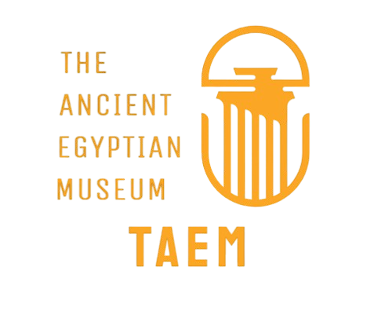

**A Comprehensive Museum Management System for Cultural Heritage Preservation**

[](https://www.php.net/)
[](https://www.mysql.com/)
[](https://getbootstrap.com/)

[📸 Screenshots](#-screenshots) • [🚀 Quick Start](#-quick-start) • [📧 Contact](#-contact)

</div>

---

## 📋 Table of Contents

- [Project Overview](#-project-overview)
- [Key Features](#-key-features)
- [Technology Stack](#-technology-stack)
- [Screenshots](#-screenshots)
- [Quick Start](#-quick-start)
- [Project Structure](#-project-structure)
- [Contact](#-contact)

---

## 🎯 Project Overview

**The Ancient Egyptian Museum (TAEM)** is a full-stack web application designed to manage museum operations and enhance visitor engagement. The system provides a complete solution for handling artifacts, exhibitions, bookings, memberships, donations, and educational programs.

### Project Scope

TAEM is a **comprehensive museum ecosystem** with the following modules:

| Module | Functionality |
|--------|--------------|
| **Visitor Management** | Online bookings, ticketing, guided tours, family/group visits |
| **Artifact Catalog** | Digital cataloging, collections management, exhibition tracking |
| **Financial System** | Payment processing, donation tracking, membership subscriptions |
| **User System** | Multi-role authentication (Admin, Member, Researcher, Volunteer, Patron) |
| **Content Management** | Events scheduling, photo galleries, blog posts, educational resources |
| **Communication** | Contact forms, volunteer applications, email notifications |

### Architecture Highlights

- **Custom MVC Framework** - Built from scratch using PHP
- **Design Patterns** - Implements Strategy, Observer, Factory, and Singleton patterns
- **Database Abstraction** - Supports both MySQL and SQLite
- **Security First** - Password hashing, SQL injection prevention, session management
- **Responsive Design** - Mobile-first approach with Bootstrap 5

---

## ✨ Key Features

### 🔐 Security
- Secure password hashing with BCRYPT
- SQL injection protection via PDO prepared statements
- Role-based access control
- Session management with secure tokens

### 🎨 User Experience
- Fully responsive design for all devices
- Modern UI with Bootstrap 5
- Intuitive navigation and user-friendly interface
- Interactive forms with real-time validation

### 💼 Business Features
- **Booking System** - Real-time ticket booking with confirmation
- **Payment Processing** - Secure payment handling with multiple methods
- **Membership Plans** - Tiered memberships with auto-renewal
- **Donation Platform** - Track contributions and generate receipts
- **Event Management** - Schedule and promote museum events
- **Volunteer Portal** - Recruitment and management

---

## 💻 Technology Stack

### Backend
- **PHP 8.0+** - Core programming language
- **MySQL / SQLite** - Database systems
- **PDO** - Database abstraction layer
- **Composer** - Dependency management

### Frontend
- **HTML5 & CSS3** - Markup and styling
- **Bootstrap 5** - Responsive framework
- **JavaScript (ES6+)** - Interactive features
- **jQuery** - DOM manipulation
- **Chart.js** - Data visualization
- **Font Awesome** - Icon library

### Architecture
- Custom MVC framework
- RESTful API structure
- Design patterns (Strategy, Observer, Factory, Singleton)
- PSR-4 autoloading

---

## 📸 Screenshots

### 🏠 Homepage
<div align="center">

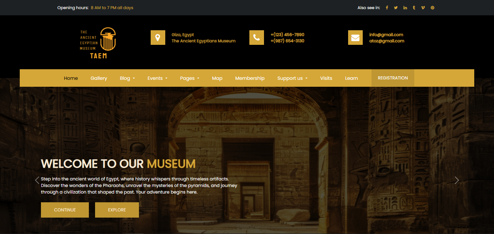
*Hero section with featured exhibitions*

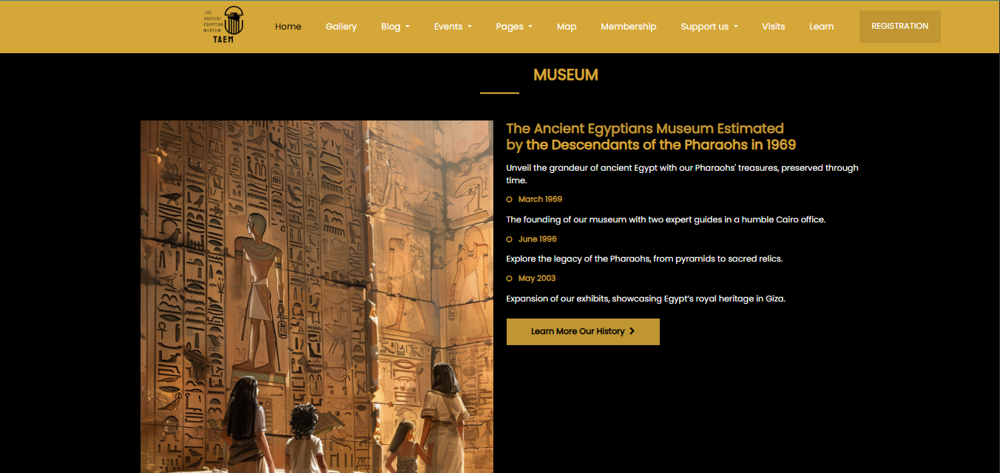
*Artifact collections showcase*

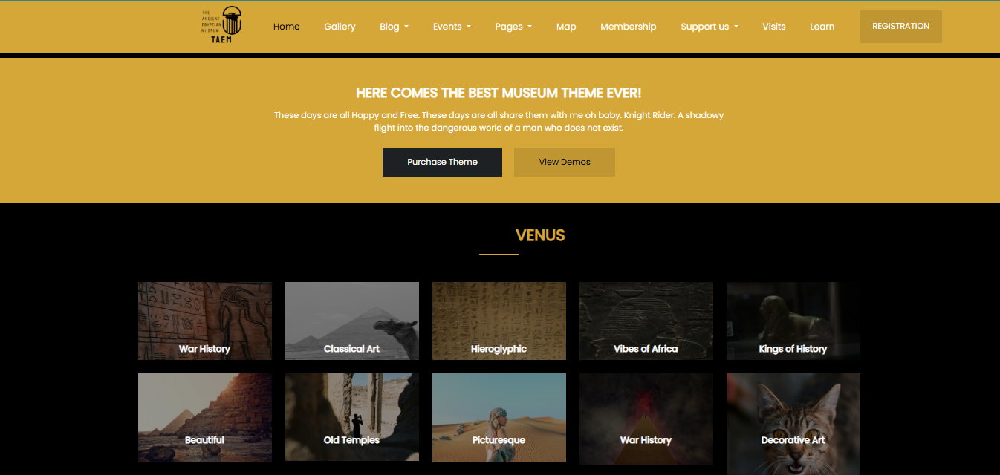
*Virtual tour preview*

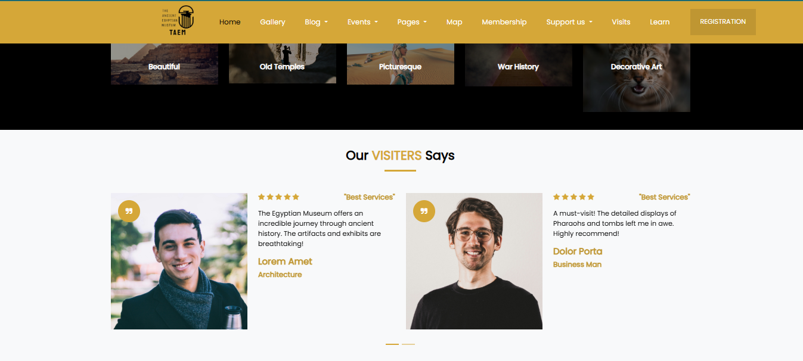
*Upcoming events and programs*

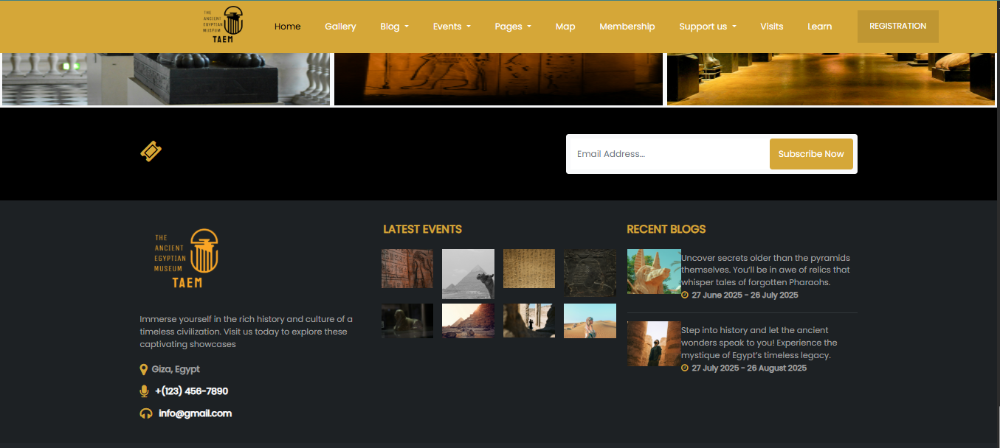
*Contact information and newsletter signup*

</div>

---

### 📅 Events & Programs
<div align="center">

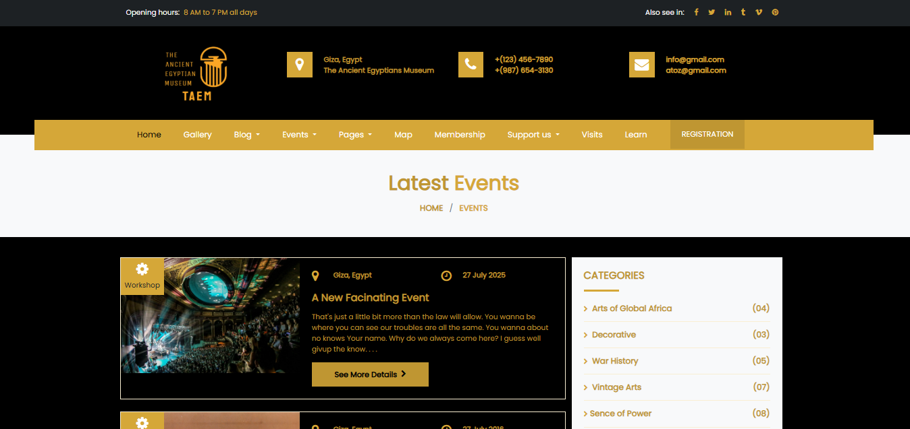
*Educational programs and special exhibitions*

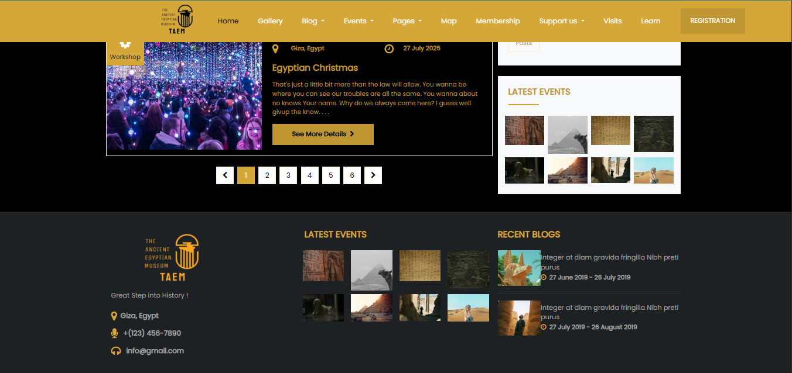
*Event information and registration*

</div>

---

### 🎟️ Booking System
<div align="center">

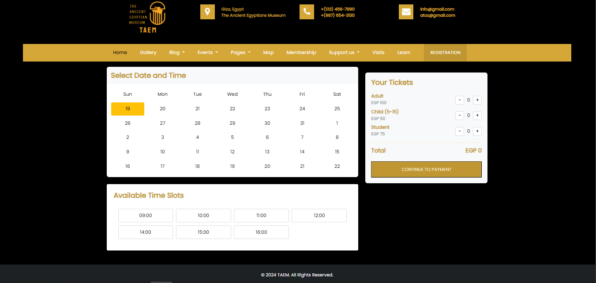
*Interactive booking form with real-time validation*

</div>

---

### 💝 Donation Platform
<div align="center">

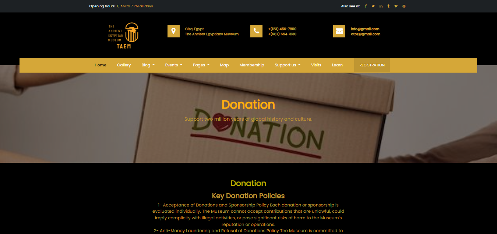
*Donation programs and contribution tiers*

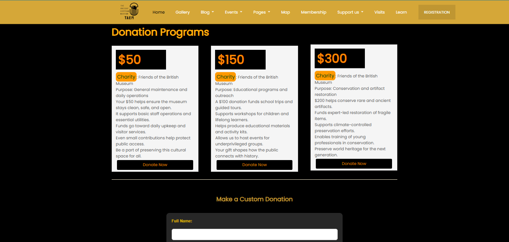
*Secure donation processing*

</div>

---

### 🎫 Membership Programs
<div align="center">

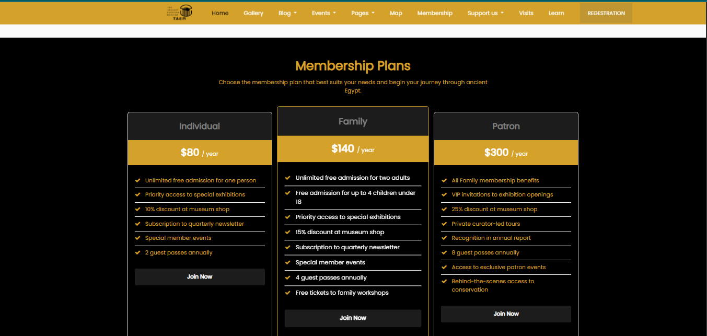
*Membership tiers and exclusive benefits*

</div>

---

### 🗺️ Interactive Museum Map
<div align="center">

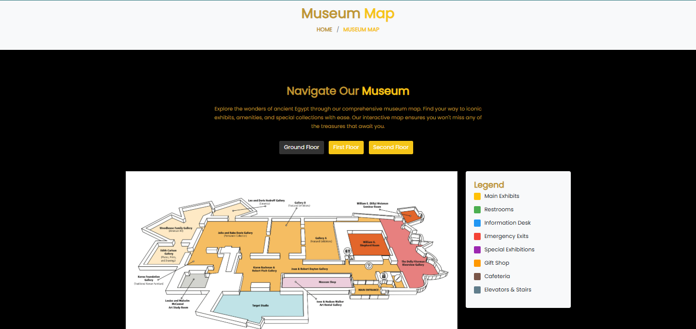
*Interactive floor plan and exhibit locations*

</div>

---

### 🤝 Volunteer Portal
<div align="center">

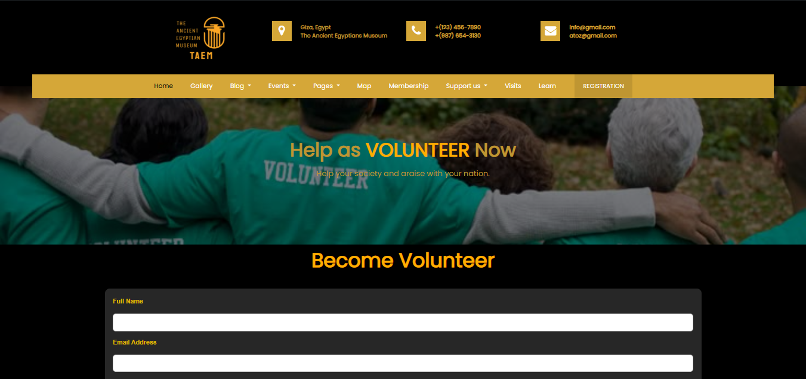
*Volunteer registration and opportunities*

</div>

---

## 🚀 Quick Start

### Prerequisites
- PHP 8.0 or higher
- MySQL 8.0 or XAMPP/WAMP
- Composer (optional for full features)

### Installation

**1. Clone the Repository**
```bash
git clone https://github.com/yourusername/Formal_TAEM.git
cd Formal_TAEM
```

**2. Configure Environment**

Edit `.env` file:
```env
APP_NAME="Ancient Egyptian Museum"
DB_HOST=localhost
DB_NAME=ancient_museum
DB_USER=root
DB_PASS=your_password
```

**3. Set Up Database** (Optional - for backend features)
```bash
mysql -u root -p
CREATE DATABASE ancient_museum;
```

**4. Start Development Server**

**Option A: PHP Built-in Server**
```bash
php -S localhost:8000 -t public
```

**Option B: Python HTTP Server (Frontend Only)**
```bash
cd Formal_TAEM
python -m http.server 8000
# Visit: http://localhost:8000/views/index.html
```

**Option C: Windows Batch Script**
```bash
start-server.bat
```

**5. Open in Browser**
```
http://localhost:8000/views/index.html
```

### 🎉 You're Ready!
Navigate through the website and explore all features.

---

## 📁 Project Structure

```
Formal_TAEM/
├── 📁 public/                  # Application entry point
├── 📁 views/                   # HTML templates (20+ pages)
├── 📁 css/                     # Stylesheets
├── 📁 js/                      # JavaScript files
├── 📁 img/                     # Images and assets
├── 📁 Models/                  # Database models (15+ models)
├── 📁 App/Controllers/         # Application controllers
├── 📁 src/                     # Core framework
│   ├── Database/              # Database layer
│   ├── Http/                  # Routing & HTTP handling
│   ├── Validation/            # Validation engine
│   └── Support/               # Helper utilities
├── 📁 config/                  # Configuration files
├── 📁 routes/                  # Route definitions
├── 📁 dashboard/               # Admin dashboard
├── 📁 Website-Screenshots/     # Project screenshots
├── .env                        # Environment variables
├── composer.json               # PHP dependencies
└── README.md                   # This file
```

---

## 🌟 Project Highlights

### Technical Excellence
- **15+ Database Models** with comprehensive relationships
- **20+ View Templates** with responsive design
- **Custom Validation Engine** with extensible rules
- **4 Design Patterns** (Strategy, Observer, Factory, Singleton)
- **Secure Authentication** with role-based access
- **Clean Code** following PSR standards

### Developer Skills Demonstrated
- Full-stack web development (PHP, MySQL, JavaScript)
- Custom MVC framework development
- Object-oriented programming and design patterns
- Database design and optimization
- Security best practices (OWASP guidelines)
- Responsive UI/UX design
- Version control with Git

---

## 📄 License

This project is licensed under the MIT License.

---

## 📧 Contact

**Developer**: Anas
**Email**: spaniol188@gmail.com

For questions, feedback, or collaboration opportunities, feel free to reach out!

---

<div align="center">

**Built with ❤️ for cultural heritage preservation**


---

© 2024 The Ancient Egyptian Museum. All rights reserved.

</div>
